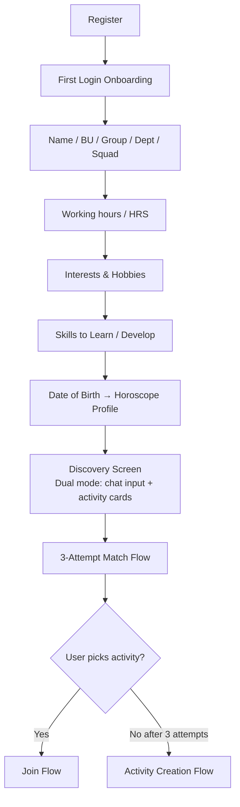
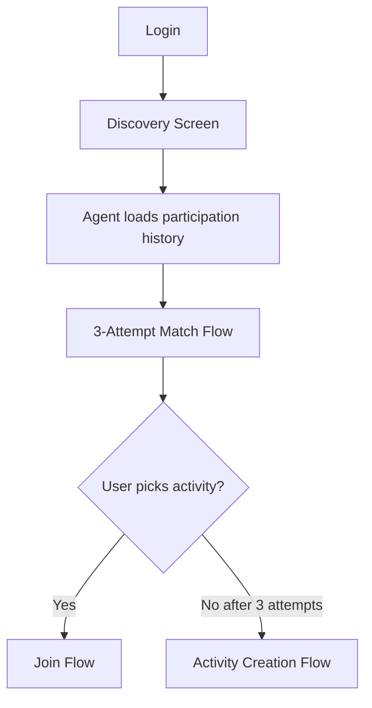
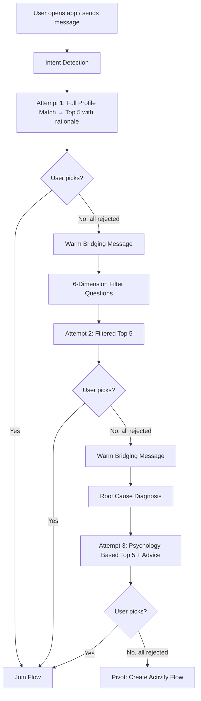

# PART 2: ACTIVITY LIFECYCLE

## Activity Creation

> 🟡 Partial — create and delete exist in backend, but delete is not exposed in the UI

Users can create activities and delete their activities

Example:

Football Match

* Time: 18:00
* Location: Field #3
* Need 2 more players

The system creates an activity record.

---

## Activity Capacity

> ✅ Implemented

Each activity contains:

* participant_limit
* current_participants

Example:

Football Match

* participant_limit = 10
* current_participants = 8

---

## Activity Guidelines

> 🟡 Partial — field exists in DB, but not shown in the join flow UI

Each activity contains preparation information.

Examples:

### Football

* Bring football shoes
* Arrive 10 minutes early
* Field #3

### Yoga

* Bring a towel
* Arrive 5 minutes early

### AI Study Group

* Bring a laptop
* Topic: AI Agents

The user should understand what to expect before joining.

---

## Join Flow

> 🟡 Partial — direct join is implemented, but no pre-confirm step showing activity details and guidelines before the user commits

When a user clicks Join:

1. Show activity details
2. Show activity guidelines
3. User confirms participation
4. Create participant record
5. Increase participant count
6. Notify activity host
7. Store participation history

---

## Host Notification

> ✅ Implemented

When a participant joins:

Notify the activity host.

Example:

> Nguyen Thanh An joined your Football Match.

---

## Activity Full Handling

> ✅ Implemented

When:

current_participants >= participant_limit

Then:

status = inactive

Inactive activities:

* Hidden from recommendations
* Cannot accept new participants
* Remain visible in history

Notify host:

> Football Match is now full.

---

## Activity States

> 🟡 Partial — only `active/inactive` states exist in the DB; the full Created → Open → Matched → Confirmed → Completed → Archived state machine is not implemented

| State | Description |
|---|---|
| **Created** | Activity submitted by a host. Awaiting activation. |
| **Open** | Activity is visible and accepting participants. |
| **Matched** | A user has been matched and shown the activity but has not yet confirmed joining. |
| **Confirmed** | Participant has confirmed joining. Host has been notified. |
| **Completed** | Activity has been marked as completed by host or participant. |
| **Archived** | Activity is past its date or was cancelled. Hidden from discovery. |

State transitions:

```
Created → Open → Matched → Confirmed → Completed → Archived
                                    ↘ Cancelled → Archived
```

---

## New User Journey

> ✅ Implemented (basic flow implemented)



---

## Returning User Journey

> ✅ Implemented (basic flow implemented)



---

## Chat Flow State Machine

> ❌ Not implemented — the entire 3-attempt structure is not implemented; only 1 round of recommendations is produced



---

## Match Attempt 1 — Full Profile Match

> 🟡 Partial — agent recommends activities, but no explicit curated Top 5 with individual natural-language rationale per item

* Run full match engine across all 6 criteria
* Output Top 5 ranked activities
* Each recommendation includes a brief natural-language rationale
* Present as curated selection, not a list dump

Example agent message:
> "Based on your interest in AI and your free evening tonight, here are my top picks for you."

---

## Match Attempt 2 — Personalized Filter Layer

> ❌ Not implemented

Agent asks 3–4 follow-up questions across 6 dimensions:

| Dimension | Example Question |
|---|---|
| Energy level | "How's your energy right now — high, medium, or low?" |
| Social preference | "Do you feel like being around people or keeping it solo today?" |
| Environment | "Indoor or outdoor?" |
| Time available | "How much time do you have — 30 mins, 1–2 hours, or a full evening?" |
| Hobby angle | "Anything specific you've been wanting to try lately?" |
| Skill motivation | "Is there a skill you've been meaning to work on but haven't found the right moment for?" |

* Re-run match engine with filter answers applied
* Output new Top 5 (must differ from Attempt 1 set)
* Frame as: *"Based on what you just told me, here are my best picks right now."*

---

## Match Attempt 3 — Root Cause / Wellbeing Intervention

> ❌ Not implemented

Agent shifts tone. Stops pushing activities. Starts listening.

Opening:
> "Sometimes when nothing feels right, there's usually something deeper going on. Mind if I ask you a few questions?"

### 5 Stress Groups

| Group | Symptoms | Psychology-Based Activity Approach |
|---|---|---|
| 1. Work overload / Burnout | Too much on plate, no mental space | Gentle solo low-intensity (walking, light yoga, stretching) |
| 2. Social isolation | Feeling unseen, disconnected from colleagues | Small familiar-BU group activity with known faces |
| 3. Career anxiety | Unsure of path, low motivation | Mentality/learning track with a senior Starter |
| 4. Physical fatigue | Body needs rest or movement, not stimulation | Physical recovery (swimming, slow run, nature walk) |
| 5. Emotional stress | Personal issues bleeding into work | Quiet creative or outdoor solo activity |

Once group identified:
* Agent provides 2–3 short, empathetic, practical pieces of advice
* Final Top 5 framed as: *"I think these might actually help with what you're going through."*

---

## Post-Attempt-3 Fallback — Activity Creation

> ❌ Not implemented

If no match after 3 attempts, agent pivots positively:

> "You know yourself best — maybe the perfect activity just doesn't exist yet. Why not create it? I'll help you set it up and find people who'd love to join."

* User enters Activity Creation flow as host
* Treated as a positive outcome, not a failure
* User contributes to platform activity supply and gets an activity perfectly tailored to their needs

---

## Post-Match Notification Flow

> 🟡 Partial — host is notified when a participant joins, but no icebreaker or warm intro message is sent to both parties

After participant confirms joining, system sends warm notification to BOTH participant and host.

Notification content:
* Friendly intro message for both parties
* Display name (internal domain) of each person
* Light icebreaker prompt or fun fact about the shared activity

**Purpose:** Eliminate the "who messages first" awkwardness and maximize the chance the activity actually happens in real life.

---

## Activity Management Flow (Hosts)

> ❌ Not implemented

After creating an activity, hosts access a management view:

| Action | Description |
|---|---|
| View matches | See list of users who matched and expressed interest |
| Confirm participant | Accept a matched user → trigger post-match notification |
| Reject participant | Remove user from candidates |
| Message participants | Send follow-up chat to confirmed participants |
| Mark as completed | Close activity after it happens → trigger completion tracking |
| Cancel activity | Cancel with automatic notification to all confirmed participants |

---

## Reminder Trigger Sequence

> ❌ Not implemented

| # | Trigger Condition | Recipient | Message |
|---|---|---|---|
| 1 | Match confirmed + invite not sent/accepted within 2h | Both | Remind to send or accept invite |
| 2 | Day before activity + attendance not confirmed | Both | Confirm attendance reminder |
| 3 | Morning of activity day | Both | "Good luck / have fun" + check-in prompt at start |
| 4 | After expected end time | Both | Prompt to mark completed + leave emoji reaction |
| 5 | 3 days after activity | Participant | "Did you connect with [name] again?" → save contact / suggest next activity |

All reminders sent as conversational chat messages — not push notifications.

---

## Incentive Mechanic Triggers

> ❌ Not implemented

| Incentive | Trigger Event |
|---|---|
| Activity Streak increment | User marks activity completed → streak +1 for that week |
| Streak milestone celebration | Streak reaches 3, 5, or 10 → agent sends congratulations |
| Explorer Badge awarded | User completes activity at a NEW on-campus location for the first time |
| Connector Score increment | User completes activity with participant from a different BU → +1 |
| Host Karma increment | Participant marks host's activity as completed → host karma +1 |
| Karma priority access unlocked | Host karma reaches threshold → priority booking on popular on-campus slots |
| New Starter Bonus | User within first 30 days on platform → all karma awards doubled |
